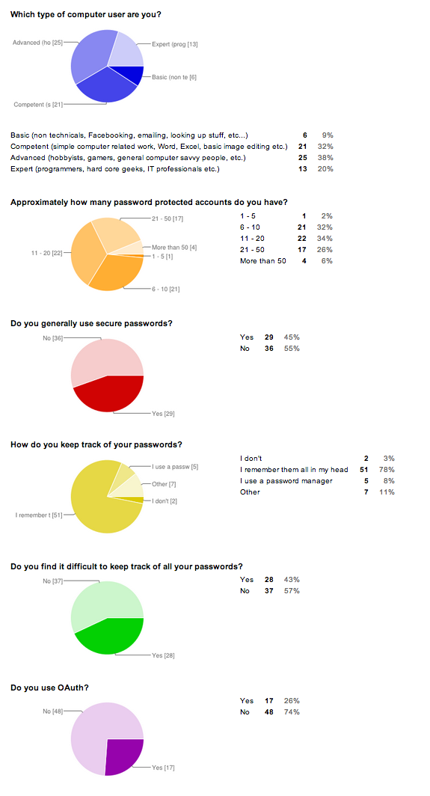

# Passwords - subject for deprecation?

_By Jimmy Börjesson (jb222rw)_

## Introduction

At the time of writing, the Heartbleed scandal is just about to blow over. Its effects was not
disastrous for me, though no less than annoying. I had unique, randomly generated passwords on every
site, and they were all stored in a password manager with a locally encrypted database. Even if it
was transfered over a vulnerable connection, the key has never been transfered and just one layer of
the encryption would have been endangered.

Changing out all of my passwords took less than an hour, my password manager made it very simple to
generate new ones, but I still had to go through the forms on every single website. I was feeling
pretty happy with myself, this process would have taken me more than three times as long a year ago.

I then remembered that my mother would have to go through this process as well, but her password
manager was a paper notebook. It was her compromise when I argued that she needed unique passwords,
but she thought password managers were too complicated. Suddenly I wasn't feeling so good about
being able to switch out my passwords on 30 different accounts so quickly. I knew that the few
accounts she needed to change was going to cause her more trouble than all of mine - maybe password
managers are not the perfect solution to this problem.

Many people will use the same password everywhere\[6\], and it will probably be a bad
password\[1\]. We can try to educate people, making them aware that they need to
think about security and that they should install extra software for keeping all of their passwords
safe, but they just want to get into their accounts as smoothly as possible, and be confident that
nobody else will. Passwords are putting a lot of the responsibility of account security on the user.
**Is this really their problem?**

## Background

### Question

**Why are bad passwords so common? Is this a problem with the users, or a problem with passwords as
as a technology?**

### Purpose

People are generally bad at using good passwords\[1\]. The purpose of this paper is to
explore why that is the case, and explore the alternative forms of authentications.

### Previous studies

There has been many articles\[1\]\[2\]\[3\] that measure the type of
passwords people use, but the general purpose seems to be to educate people to come use better
passwords. This paper puts the responsibility on the developers instead.

One common alternative to passwords is OAuth\[4\], but there has been some suggestions of
other methods as well, like using email as authentication\[5\]. Of course in the
future we might have access to more technology (like retina scanners, more accurate facial
recognition, et cetera), but today there does not seem to be an option that is as simple to
implement as passwords.

## Keywords

passwords, security, safety, authentication

## Method

I've decided to use a survey to broadly investigate how people manage passwords and how they feel
about doing so. I've chosen to distribute the survey through Facebook to hopefully yield a somewhat
statistically significant number of responses in a short period of time. The questions that the
survey consists of are in an attachment.

I chose to do a survey because it will give a broad sense of the opinions of ordinary people. I will
be using a Google Drive form to collect answers, as this easily gives you a URL to the form that can
be distributed, but also makes it possible to export the data as CSV or view it in spreadsheets.

## Method discussion

### Advantages

Distributing an online survey via Facebook is a very simple and pain free process that can yield
empirical, real world data quickly. I tried to make sure that the survey was quick to finish and
anonymous so that users would not be discouraged from participating. I also give the participants a
couple of optional text fields where they could express their opinions more freely. The text fields
may indicate some common behavior that was not directly part of the survey, and can lead to further
research.

I personally believe that my Facebook friends are pretty diverse, but I have also let the
participants place themselves in a category based on their level of computer skills. This might show
differences between more experienced computer users who likely have more accounts, and less
experienced users who might not know about the tools that exist to simplify password management.

### Disadvantages

Since this was an anonymous survey, participants has little to no incentive to answer honestly, and
it is not unlikely that participants answer some questions in a way that pleases their self image
even if it is anonymous.

It was also possible to go through the form multiple times. That said, there is no gain in doing
this other than pure spite, and as I've been following along with the rate responses have been
coming in I have seen nothing that would indicate this, hence I'm going to assume that the answers I
have received are valid.

## Survey questions

### Which type of computer user are you?

- Basic (non technicals, Facebooking, emailing, looking up stuff, etc...)
- Competent (simple computer related work, Word, Excel, basic image editing etc.)
- Advanced (hobbyists, gamers, general computer savvy people, etc.)
- Expert (programmers, hard core geeks, IT professionals etc.)

### Approximately how many password protected accounts do you have?

> Facebook, GMail, Twitter, etc...

- 1 - 5
- 6 - 10
- 11 - 20
- 21 - 50
- More than 50

### Do you generally use secure passwords?

> Answer "No" if you use the same passwords on multiple accounts, or if they are usually
> shorter than 8 characters. Answer "Yes" if you use unique, strong passwords on all or most of
> your accounts.

- No
- Yes

### How do you keep track of your passwords?

- I don't
- I remember them all in my head
- I use a password manager
- Other (text)

### Do you find it difficult to keep track of all your passwords?

- Yes
- No

### Do you use OAuth?

> "Log in with Facebook/Twitter" and similar

- Yes
- No

### If yes, do you prefer using it over passwords? Why?

- (text)

### Other relevant opinions

- (text)

## Survey answers

### Charts

Here are the results of the checkbox questions of the survey.

### Text questions

**If yes, do you prefer using it over passwords? Why?**

- Easier to use
- I am lazy.
- I don't have to remember my password.
- No, I feel like I'm giving away too much information.
- easy
- no. I only use it with a fake account for accounts I don't consider important. I wouldn't want my personal information to be linked w/ my facebook or such.
- No.  It's easier but not safe!
- Quicker and easier then looking up my password
- You don't have to remember which password you use for that specific site
- Prefer seamless browsing with as few logins as possible - for unimportant services.
- Känns inte säkert att använda en annan profil till en hemsida som man kan göra en profil på själv.
- easier to access, integrity gets worse
- No just easy
- Nope, have to use it for some schoolrelated things though
- I need to remember less passwords.
- Det är lättare.

**Other relevant opinions**

- I use insecure passwords for pages I don't consider important, and secure ones on accounts that are (e.g. related to money or similar)
- I only use unique strong passwords on accounts I care about
- I find last pass to be very convenient, but i don't use it on all my machines and therefore need to memorize my passwords anyway.
- Trash accounts have low security passwords, important ones strong randomly generated passwords
- hönökakapizza, gissa vem ;)

## Result

All the answers are attached in the Survey answers section, they were collected in May 2014 from 65
of my Facebook friends. The survey was anonymous.

### Summary

A majority of participants(78%) do not use any tool to remember their passwords, 55% do **not** use
secure passwords in general, and 57% find it difficult to keep track of their passwords. How many
accounts the participants had was very spread out, except that very few (only one) had less than 6
accounts.

Some people who use OAuth like it because it's easier or quicker, while other are sceptical about
the security, or feel like they are giving up too much information.

Multiple participants have commented that they use secure passwords only for the accounts they think
are important, and use less secure ones on other accounts.

## Discussion

A surprisingly large portion of participants remember all of their passwords manually, I would have
expected more people to use password managers or even pen and paper (which was sadly not an explicit
alternative to the question) to remember their passwords.

Even though 78% remember their passwords by heart, only 43% find it difficult to keep track of them.
It would be interesting to see what the reason for this gap is, if it is because they use the same
password for many things, that they just have a very good memory, that they are using some kind of
system to memorize them, or perhaps using real phrases as passwords.

More than half of the participants do **not** use secure passwords, this sounds very worrying to me.
That said, the specified definition of "generally using secure passwords" was very strictly
formulated in the question, which may have led to this number being higher than it should be.
Perhaps this question should have had more alternatives, or even have been divided into multiple
questions.

### Further studies

I'm not completely happy with the questions that I used in the survey, if I were to do it again I
would probably add "I don't know" as an option to some of the questions, and perhaps added a "I
write them down on paper" answer to the "How do you keep track of your passwords?" question.

The question I regret not adding the most is "How many different passwords do you use?". It would
have given a much better picture of the gap between how many accounts people have and how many of
them share the same passwords.

It would of course be nice to have a much larger number of participants to get better statistical
results, but it was not possible in the very limited time that this paper was written in.

## Sources

\[1\] http://splashdata.com/press/worstpasswords2013.htm

\[2\] http://blogs.wsj.com/digits/2010/12/13/the-top-50-gawker-media-passwords/

\[3\] http://blog.eset.se/statistics-about-yahoo-leak-of-450-000-plain-text-accounts/

\[4\] http://oauth.net/

\[5\] http://notes.xoxco.com/post/27999787765/is-it-time-for-password-less-login

\[6\] https://www.paypal-media.com/assets/pdf/fact_sheet/cis_paypal_whitepaper_final.pdf

\[7\] Communications of the ACM. Feb2013, Vol. 56 Issue 2, p40-44. 5p. 1 Color Photograph, 2 Charts.

\[8\] Behaviour & Information Technology. May/Jun2010, Vol. 29 Issue 3, p233-244. 12p. 1 Diagram, 2 Charts, 3 Graphs.

\[9\] Communications of the ACM. Sep2010, Vol. 53 Issue 9, p15-15. 1/4p.

